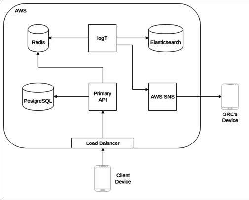

# NoteGala

NoteGala is an Android application that allows people to create, edit, and
categorize notes. The client is backed by a public GraphQL API that can
readily accommodate new clients or integrations.

## Demo Media
You can find GIFs of the app in action [here](res/demo).

## Architecture

### Disclaimer
The back end is a bit over-engineered for the current scale. This reflects the fact that
the project is primarily an educational pursuit.

#### System Flow
User devices submit requests alongside Google credentials to a load-balanced API. These CRUD
requests are satisfied by a backing PostgreSQL instance, which stores the majority of
the system data. In addition to typical SQL queries, postgres also handles full-text search
for notes.

While handling a request, the API will generate logs with standard severity levels. These
logs are published to Redis channels and then picked up by logT. The log service currently
forwards all data to an Elasticsearch instance, but the plan is to additionally send critical
logs by email or SMS to an operator.

#### CI/CD
Jenkins performs integration and deployment for the API. A multibranch pipeline
runs its tests in an isolated Docker Compose environment. If they pass, the code becomes
eligible for a PR into master. Should that also succeed, the code is retested and then
deployed into production. It is important that, when modifying the API, you also update
its semantic version; failure to do so will result in no deployment.

#### Container Orchestration
[Kubernetes](https://github.com/kubernetes/kubernetes) manages the life cycle of Docker
containers and their secrets. Any of the configuration files that can be put into Git
will go in the [cluster directory](cluster/).

#### Cloud Infrastructure
Everything is AWS. Here's a nice list:
- Route 53
    - Handles the DNS configuration for the project
- RDS
    - Manages the PostgreSQL instance
- EC2 / EBS
    - Provides node/storage resources for the cluster
- S3
    - Stores [kops](https://github.com/kubernetes/kops) information for the cluster
- ELB
    - Provides classic load balancing for Kubernetes services
- Elasticsearch
    - Houses Elasticsearch but also a pretty sweet Kibana instance
- ElastiCache
    - Vehemently guards Redis
